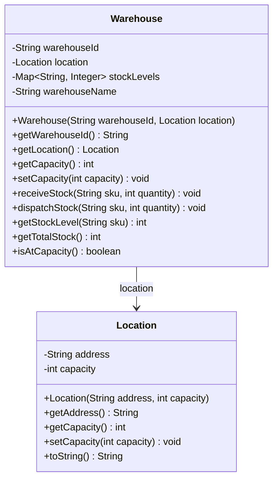

# Class Diagram

```mermaid
classDiagram
    class Location {
        -String address
        -int capacity
        +Location(String address, int capacity)
        +getAddress() String
        +getCapacity() int
        +setCapacity(int capacity) void
        +toString() String
    }

    class Warehouse {
        -String warehouseId
        -Location location
        -Map~String, Integer~ stockLevels
        -String warehouseName
        +Warehouse(String warehouseId, Location location)
        +getWarehouseId() String
        +getLocation() Location
        +getCapacity() int
        +setCapacity(int capacity) void
        +receiveStock(String sku, int quantity) void
        +dispatchStock(String sku, int quantity) void
        +getStockLevel(String sku) int
        +getTotalStock() int
        +isAtCapacity() boolean
    }

    Warehouse --> Location : location
```
