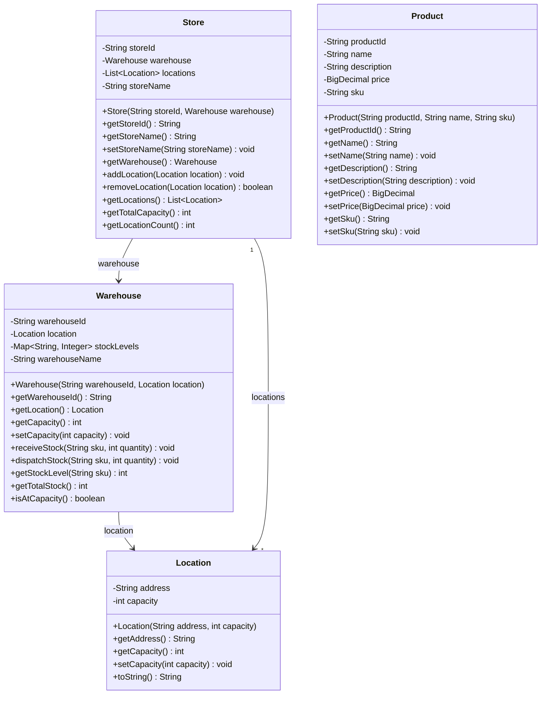

# Class Diagram

```mermaid
classDiagram
    class Location {
        -String address
        -int capacity
        +Location(String address, int capacity)
        +getAddress() String
        +getCapacity() int
        +setCapacity(int capacity) void
        +toString() String
    }

    class Warehouse {
        -String warehouseId
        -Location location
        -Map~String, Integer~ stockLevels
        -String warehouseName
        +Warehouse(String warehouseId, Location location)
        +getWarehouseId() String
        +getLocation() Location
        +getCapacity() int
        +setCapacity(int capacity) void
        +receiveStock(String sku, int quantity) void
        +dispatchStock(String sku, int quantity) void
        +getStockLevel(String sku) int
        +getTotalStock() int
        +isAtCapacity() boolean
    }

    class Store {
        -String storeId
        -Warehouse warehouse
        -List~Location~ locations
        -String storeName
        +Store(String storeId, Warehouse warehouse)
        +getStoreId() String
        +getStoreName() String
        +setStoreName(String storeName) void
        +getWarehouse() Warehouse
        +addLocation(Location location) void
        +removeLocation(Location location) boolean
        +getLocations() List~Location~
        +getTotalCapacity() int
        +getLocationCount() int
    }

    class Product {
        -String productId
        -String name
        -String description
        -BigDecimal price
        -String sku
        +Product(String productId, String name, String sku)
        +getProductId() String
        +getName() String
        +setName(String name) void
        +getDescription() String
        +setDescription(String description) void
        +getPrice() BigDecimal
        +setPrice(BigDecimal price) void
        +getSku() String
        +setSku(String sku) void
    }

    Warehouse --> Location : location
    Store --> Warehouse : warehouse
    Store "1" --> "*" Location : locations
```
