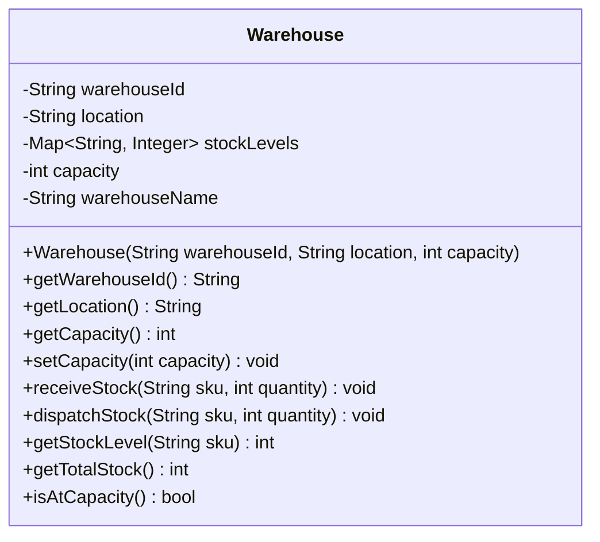

# Class Diagram

```mermaid
classDiagram
    class Warehouse {
        -String warehouseId
        -String location
        -Map~String, Integer~ stockLevels
        -int capacity
        -String warehouseName
        +Warehouse(String warehouseId, String location, int capacity)
        +getWarehouseId() String
        +getLocation() String
        +getCapacity() int
        +setCapacity(int capacity) void
        +receiveStock(String sku, int quantity) void
        +dispatchStock(String sku, int quantity) void
        +getStockLevel(String sku) int
        +getTotalStock() int
        +isAtCapacity() bool
    }
```
