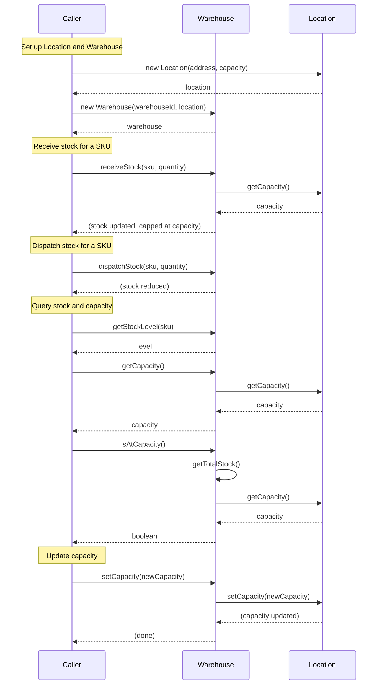

# Sequence Diagram

```mermaid
sequenceDiagram
    participant Caller
    participant Warehouse
    participant Location

    Note over Caller: Set up Location and Warehouse
    Caller->>Location: new Location(address, capacity)
    Location-->>Caller: location

    Caller->>Warehouse: new Warehouse(warehouseId, location)
    Warehouse-->>Caller: warehouse

    Note over Caller: Receive stock for a SKU
    Caller->>Warehouse: receiveStock(sku, quantity)
    Warehouse->>Location: getCapacity()
    Location-->>Warehouse: capacity
    Warehouse-->>Caller: (stock updated, capped at capacity)

    Note over Caller: Dispatch stock for a SKU
    Caller->>Warehouse: dispatchStock(sku, quantity)
    Warehouse-->>Caller: (stock reduced)

    Note over Caller: Query stock and capacity
    Caller->>Warehouse: getStockLevel(sku)
    Warehouse-->>Caller: level

    Caller->>Warehouse: getCapacity()
    Warehouse->>Location: getCapacity()
    Location-->>Warehouse: capacity
    Warehouse-->>Caller: capacity

    Caller->>Warehouse: isAtCapacity()
    Warehouse->>Warehouse: getTotalStock()
    Warehouse->>Location: getCapacity()
    Location-->>Warehouse: capacity
    Warehouse-->>Caller: boolean

    Note over Caller: Update capacity
    Caller->>Warehouse: setCapacity(newCapacity)
    Warehouse->>Location: setCapacity(newCapacity)
    Location-->>Warehouse: (capacity updated)
    Warehouse-->>Caller: (done)
```
