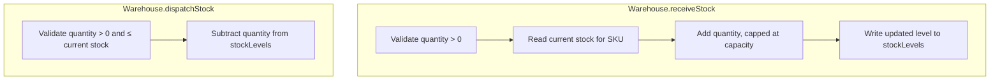

# Workflow

```mermaid
flowchart TD
    subgraph receiveStock[Warehouse.receiveStock]
        RS1[Validate quantity > 0] --> RS2[Read current stock for SKU]
        RS2 --> RS3[Add quantity, capped at capacity]
        RS3 --> RS4[Write updated level to stockLevels]
    end

    subgraph dispatchStock[Warehouse.dispatchStock]
        DS1[Validate quantity > 0 and ≤ current stock] --> DS2[Subtract quantity from stockLevels]
    end
```
