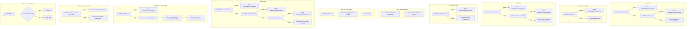

# Workflow

```mermaid
flowchart TD
    subgraph locationNew[new Location]
        L1[Validate address not blank] -->|blank| L2[throw IllegalArgumentException]
        L1 -->|valid| L3[Validate capacity > 0] -->|invalid| L4[throw IllegalArgumentException]
        L3 -->|valid| L5[Assign address and capacity fields]
    end

    subgraph locationSetCapacity[Location.setCapacity]
        SC1[Validate capacity > 0] -->|invalid| SC2[throw IllegalArgumentException]
        SC1 -->|valid| SC3[Assign capacity field]
    end

    subgraph storeNew[new Store]
        SN1[Validate storeId not blank] -->|blank| SN2[throw IllegalArgumentException]
        SN1 -->|valid| SN3[Validate warehouse not null] -->|null| SN4[throw IllegalArgumentException]
        SN3 -->|valid| SN5[Assign storeId, warehouse; init locations list]
    end

    subgraph storeAddLocation[Store.addLocation]
        SAL1[Validate location not null] -->|null| SAL2[throw IllegalArgumentException]
        SAL1 -->|valid| SAL3[Append location to locations list]
    end

    subgraph storeRemoveLocation[Store.removeLocation]
        SRL1[Remove location from locations list]
        SRL1 --> SRL2[return boolean indicating presence]
    end

    subgraph storeTotalCapacity[Store.getTotalCapacity]
        STC1[Stream locations] --> STC2[Sum location.getCapacity for each]
        STC2 --> STC3[return total]
    end

    subgraph productNew[new Product]
        PN1[Validate productId not blank] -->|blank| PN2[throw IllegalArgumentException]
        PN1 -->|valid| PN3[Validate name not blank] -->|blank| PN4[throw IllegalArgumentException]
        PN3 -->|valid| PN5[Validate sku not blank] -->|blank| PN6[throw IllegalArgumentException]
        PN5 -->|valid| PN7[Assign productId, name, sku fields]
    end

    subgraph receiveStock[Warehouse.receiveStock]
        RS1[Validate quantity > 0] -->|invalid| RS2[throw IllegalArgumentException]
        RS1 -->|valid| RS3[Read current stock for SKU]
        RS3 --> RS4["Add quantity, capped at location.getCapacity()"]
        RS4 --> RS5[Write updated level to stockLevels]
    end

    subgraph dispatchStock[Warehouse.dispatchStock]
        DS1[Validate quantity > 0 and ≤ current stock] -->|invalid| DS2[throw IllegalStateException]
        DS1 -->|valid| DS3[Subtract quantity from stockLevels]
    end

    subgraph isAtCapacity[Warehouse.isAtCapacity]
        IAC1[getTotalStock] --> IAC2{"≥ location.getCapacity()?"}
        IAC2 -->|yes| IAC3[return true]
        IAC2 -->|no| IAC4[return false]
    end
```
