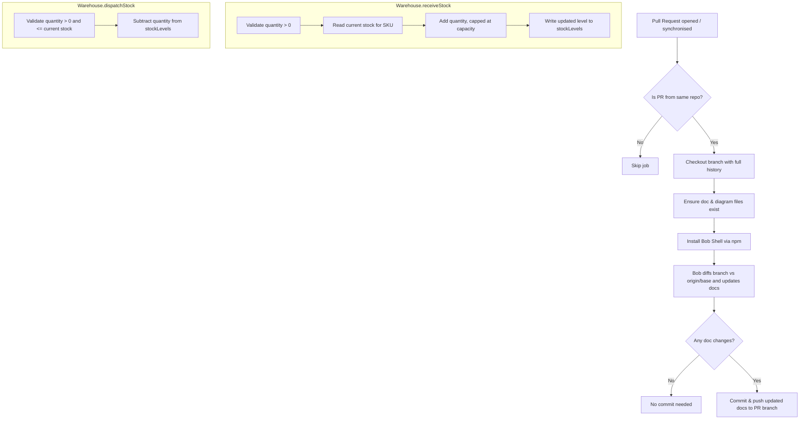

# Workflow

```mermaid
flowchart TD
    PR[Pull Request opened / synchronised] --> CHECK{Is PR from same repo?}
    CHECK -- No --> SKIP[Skip job]
    CHECK -- Yes --> CHECKOUT[Checkout branch with full history]
    CHECKOUT --> ENSURE[Ensure doc & diagram files exist]
    ENSURE --> INSTALL[Install Bob Shell via npm]
    INSTALL --> BOB[Bob diffs branch vs origin/base and updates docs]
    BOB --> DIRTY{Any doc changes?}
    DIRTY -- No --> DONE[No commit needed]
    DIRTY -- Yes --> COMMIT[Commit & push updated docs to PR branch]

    subgraph receiveStock[Warehouse.receiveStock]
        RS1[Validate quantity > 0] --> RS2[Read current stock for SKU]
        RS2 --> RS3[Add quantity, capped at capacity]
        RS3 --> RS4[Write updated level to stockLevels]
    end

    subgraph dispatchStock[Warehouse.dispatchStock]
        DS1[Validate quantity > 0 and <= current stock] --> DS2[Subtract quantity from stockLevels]
    end
```
